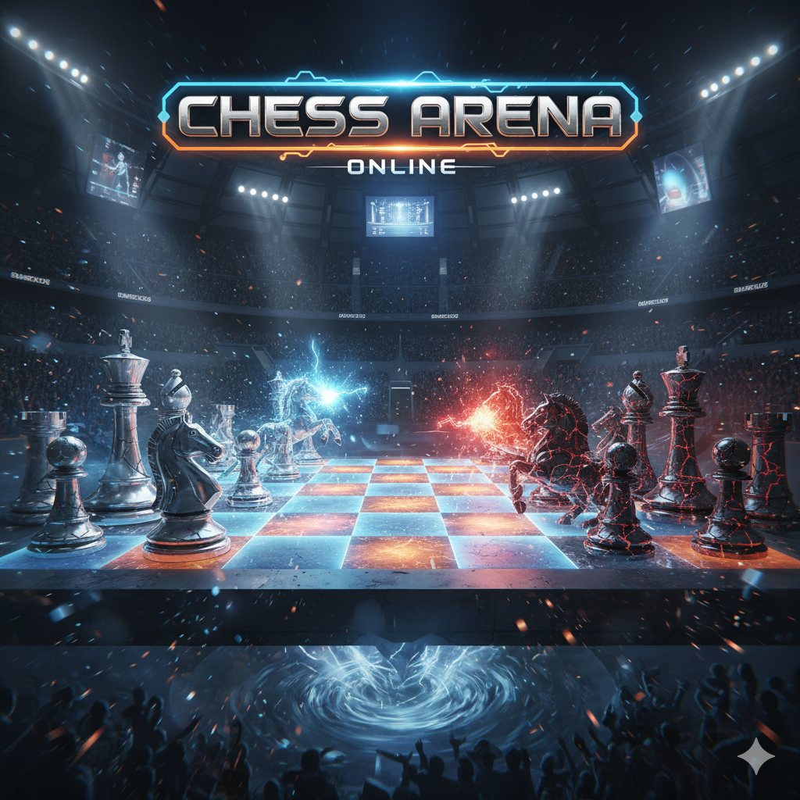

# ♚ ChessArena

A full-stack chess platform with AI opponents, post-game analysis, puzzles, and ELO rating tracking.



## Features

### Play
- **8 AI difficulty levels** (400–2500 ELO) powered by Stockfish 18 WASM
- **Time controls**: Bullet (1+0), Blitz (5+0, 5+3), Rapid (15+10)
- **Move animations** with drag-to-move and click-to-move
- **Premove support** — queue your next move during opponent's turn
- **Sound effects** — sample-based audio with procedural fallback
- **Draw offers, resignation, takeback/undo**

### Analyze
- **Post-game engine analysis** at depth 14 through every position
- **Move classification**: brilliant, great, best, good, inaccuracy, mistake, blunder
- **Eval graph** — SVG area chart showing who's winning across all moves
- **Move annotations** — contextual explanations for mistakes/blunders with best move suggestions
- **Replay controls** — step through the game with ⏮ ◀ ▶ ⏭ buttons or arrow keys
- **Accuracy calculation** using the Lichess formula
- **Best-move arrows** shown per position during review

### Train
- **50 puzzles** sourced from the Lichess puzzle database (CC0), rated 495–2861
- Auto-play setup move, then find the correct sequence
- Retry on failure, skip to next puzzle

### Track
- **ELO rating system** with separate bullet/blitz/rapid ratings
- **Player profile** with rating history chart, game history, win/loss/draw stats
- **Title progression**: Beginner → Club Player → Intermediate → Advanced → Expert → Candidate Master → Master → Grandmaster
- **Opening name display** — ECO codes and names shown during play

### UI/UX
- **Dark theme** with warm color palette
- **Right-click arrows and square highlights** for analysis notation
- **Captured pieces display** with material difference
- **Keyboard shortcuts**: Arrow keys (navigate), F (flip board), Escape (deselect)
- **Accessibility**: ARIA live regions, timer roles, button labels, screen reader announcements
- **Responsive** — sidebar hidden on mobile, board scales 320px–900px
- **Error boundary** with game reset recovery

## Tech Stack

### Frontend
- **React 19** + **TypeScript 5.9** + **Vite 8**
- **Zustand** for state management (with Immer + persistence)
- **Tailwind CSS 4** for styling
- **Stockfish 18** WASM (single-threaded) for AI and analysis
- **chess.js** for move validation and game rules
- **Vitest** + **React Testing Library** for tests
- **@tanstack/react-virtual** for virtualized move history

### Backend
- **ASP.NET Core 10** (C#)
- **PostgreSQL 16** via Entity Framework Core
- **JWT authentication** with refresh tokens
- **Clean architecture**: Core → Application → Infrastructure → API
- **FluentValidation**, **Serilog**, **HybridCache**

## Getting Started

### Prerequisites
- Node.js 22+
- pnpm
- .NET 10 SDK
- PostgreSQL 16 (or Docker)

### Frontend

```bash
cd frontend
pnpm install

# Copy Stockfish WASM files to public directory
cp node_modules/stockfish/bin/stockfish-18-single.* public/stockfish/

pnpm dev
```

### Backend

```bash
# Start PostgreSQL
docker compose up -d

# Run the API
cd backend/src/ChessArena.Api
dotnet run
```

### Development

```bash
# Run tests
cd frontend && pnpm test

# Type check
pnpm exec tsc -b --noEmit

# Lint
pnpm lint

# Build
pnpm build
```

## Project Structure

```
├── frontend/
│   ├── public/
│   │   ├── pieces/          # SVG chess pieces (merida, neo)
│   │   ├── sounds/          # Lichess audio samples (CC0)
│   │   └── stockfish/       # Stockfish WASM (not in git, see setup)
│   └── src/
│       ├── components/
│       │   ├── board/       # ChessBoard, Piece, DragLayer, annotations
│       │   ├── game/        # ClockPanel, MoveHistory, EvalGraph, etc.
│       │   └── layout/      # GamePage, PuzzlePage, ProfilePage
│       ├── hooks/           # useChessGame, useStockfishWorker, usePuzzle, etc.
│       ├── lib/             # Utilities (openings, move-classifier, sounds, uci)
│       ├── stores/          # Zustand stores (game, auth)
│       ├── types/           # TypeScript types
│       └── constants/       # Engine levels, board themes, time controls
├── backend/
│   ├── src/
│   │   ├── ChessArena.Api/           # Controllers, middleware
│   │   ├── ChessArena.Core/          # Domain entities, interfaces
│   │   ├── ChessArena.Application/   # Services, DTOs, validators
│   │   └── ChessArena.Infrastructure/ # EF Core, repositories
│   └── tests/
└── docker-compose.yml
```

## Credits

- [Stockfish](https://stockfishchess.org/) — chess engine (GPL)
- [chess.js](https://github.com/jhlywa/chess.js) — move generation and validation
- [Lichess](https://lichess.org/) — puzzle database and sound samples (CC0)

## License

MIT
